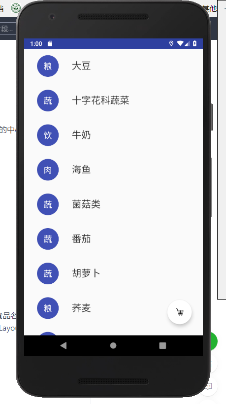
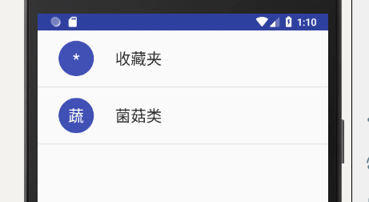
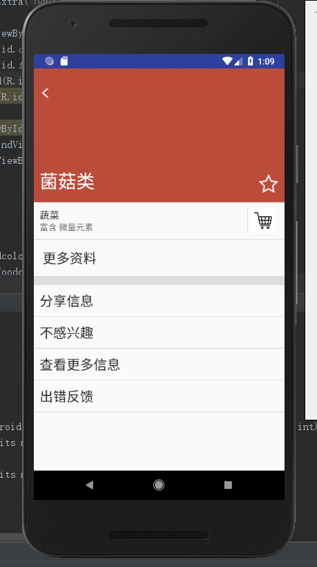
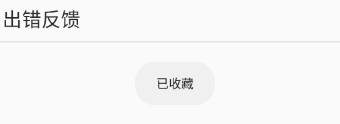
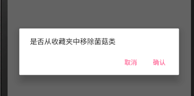

# 中山大学数据科学与计算机学院本科生实验报告
## （2018年秋季学期）
| 课程名称 | 手机平台应用开发 | 任课老师 | 郑贵锋 |
| :------------: | :-------------: | :------------: | :-------------: |
| 年级 | 16级 | 专业（方向） | 嵌入式软件与系统 |
| 学号 | 16340192 | 姓名 | 宋晓彤 |
| 电话 | 155215065877 | Email | 1252418308@qq.com |
| 开始日期 | 2018.10.11 | 完成日期 |2018.10.15|

---

## 一、实验题目

Intent、Bundle的使用以及RecyclerView、ListView的应用

---

## 二、实现内容

1. 复习事件处理。
2. 学习Intent、Bundle在Activity跳转中的应用，点击跳转页面。
3. 学习RecyclerView、ListView以及各类适配器的用法，完成布局设计。
4. 学习FloatingActionBar的用法，创建按钮。

---

## 三、实验结果
### (1)实验截图

##### 【UI界面——所有食物】



##### 【UI界面——收藏夹】



##### 【UI界面——详情页】



##### 【收藏Toast信息】



##### 【删除Toast信息】


##### 【移除Dialog信息】



### (2)实验步骤以及关键代码

**A) 主页面设计**

​	收藏夹和全部食物的两个列表的转换是通过控制一个可见另一个不可见实现的，所以我们要把两个列表和一个FloatingActionButton均在页面中声明出来，同时完成样式的设计

**B）详情页设计**

​	为方便设置权重，详情页布局使用约束布局，其中有两个子布局。

​	一个是三分之一的背景部分，内部有两个imageview分别是返回键和星标，以及一个textview表示食物名称

​	另一个是剩余部分，内部有一个类型、信息、收藏图标和分割线封装的布局，一个Textview表示更多资料，一个listview表示底部四个操作，以及其他的分割线。

（1:3代码段如下）

```
<RelativeLayout
    android:id="@+id/backgrounddiv"
    app:layout_constraintVertical_weight="1">
    
<LinearLayout
    android:id="@+id/last"
    app:layout_constraintVertical_weight="2">
```

C）编写FoodAdapter为recyclerview赋值

​	Holder类：得到相应的列表项

```
static public class ViewHolder extends RecyclerView.ViewHolder {
    public ViewHolder(View itemView){
        super(itemView);
        foodView = itemView;
        foodtitle = (TextView) itemView.findViewById(R.id.foodtitle);
        foodname = (TextView) itemView.findViewById(R.id.foodname);
    }
    static public ViewHolder get(ViewGroup parent) {
        View itemView = LayoutInflater.from(parent.getContext()).inflate(R.layout.layout,parent,false);
        final ViewHolder holder = new ViewHolder(itemView);
        return holder;
    }
}
```

​	监听操作

```
f(mOnItemClickListener != null){
    holder.itemView.setOnClickListener(new View.OnClickListener() {
        @Override
        public void onClick(View v) {
            int position = holder.getLayoutPosition();
            mOnItemClickListener.onItemClick(holder.itemView, position);
        }
    });
}
```

**C）编写CollectAdapter为listview赋值**

```
yListItemView.getTv_name()
        .setText(collectfoods.get(position).getName());
myListItemView.getTv_firstletter().setText(collectfoods.get(position).getTitle());
```

**D） main.java编写**

​	a）声明数据

​		a.定义数据：两个list，两个Adapter，两个array，name/ title/type/element/color字符串数组，FloatingActionButton控件

​		b. 食物数据类：创建新的java类文件，食物的属性字段有名称name， 首字提示title，类型type，详情element，背景颜色color，函数为五种属性的get和set函数。

​		c. Adapter调用

```
collectlist = (ListView) findViewById(R.id.foodlist);
collectlist.setAdapter(collectAdapter)；

 LinearLayoutManager layoutManager = new LinearLayoutManager(this);
        final FoodAdapter foodAdapter = new FoodAdapter(allfood);
        foodlist = (RecyclerView) findViewById(R.id.foodrecycler);
        foodlist.setLayoutManager(layoutManager);
```

​		d. 初始化数据：给所有事物的数组赋值，给收藏夹赋值收藏夹列表项

```
for (int i = 0; i < foodname.length; i++) {
    listitem all = new listitem();
    all.setName(foodname[i]);
    set();
    allfood.add(all);
}
listitem collect = new listitem();
collect.setName("收藏夹");
collect.setTitle("*");
collectfood.add(collect);
```

​	b）EventBus设置：注册事件、定义处理事件方法、解除注册

```
String msg = event.getMsg();
for(int i = 0;i<foodname.length;i++){
    if(msg.equals(foodname[i]))
    {
        listitem my = new listitem();
        my.setName(foodname[i]);
        set();
        collectfood.add(my);
        collectAdapter.notifyDataSetChanged();
    }
}
```

​	c）事件触发

​		点击FloatingActionButton：点击后控制两个列表的可见属性达到转换的目的

```
if (flag == 0){
    collectlist.setVisibility(View.VISIBLE);
    foodlist.setVisibility(View.GONE);
    changebutton.setImageResource(R.drawable.mainpage);
    flag = 1;
}
```

​	单击列表项：获取当前的状态值传递到下一个界面中，注意收藏夹的第一个位置是不可计算进去的，所以要添加条件position不为0

```
foodAdapter.setOnItemClickListener(new FoodAdapter.OnItemClickListener() {
    public void onItemClick(View view, int position) {
        Intent intent = new Intent(MainActivity.this, ListActions.class);
        intent.putExtra("food_name", allfood.get(position).getName());
        intent.putExtra(...);
        startActivity(intent, ActivityOptions.makeSceneTransitionAnimation(MainActivity.this).toBundle());
    }
});
```

​		长按列表项

```
public void onItemLongClick(View view, final int position) {
    Toast.makeText(MainActivity.this, "删除"+allfood.get(position).getName(), Toast.LENGTH_SHORT).show();
    allfood.remove(position);
    foodAdapter.notifyDataSetChanged();
}
```

**E）ActionLis.java 编写**

​	a）点击星标：设置星标图片的样式

```
if (flag == false){
    starimage.setImageResource(R.drawable.full_star);
    flag=true;
}
else{
    starimage.setImageResource(R.drawable.empty_star);
    flag=false;
}
```

​	b） 点击收藏夹：调用线程，此列表项被添加至collect的array中

```
collectimage.setOnClickListener(new View.OnClickListener() {
    public void onClick(View item) {
        EventBus.getDefault().post(new MsgEvent(foodname));
        Toast.makeText(ListActions.this, "已收藏", Toast.LENGTH_SHORT).show();
    }
});
```

​	c）点击返回 

```
backimage.setOnClickListener(new View.OnClickListener() {
    public void onClick(View v) {
        finish();
    }
});
```

### (3)实验遇到的困难以及解决思路

**A）1/3的布局实现**

​	我一开始写的布局结构很复杂，很多的布局结构在嵌套，深度能达到3层，由于放同一布局不会显示，还把几个组件单独拿了出来，在进行布局的权重分配的时候就不出意外地玄学了，weightsun和layout_weight的值都设定好，高度也设为了0dp和wrap_content，但是就是不好用。

​	后来修改了布局模式，把总体布局换成了约束布局，把界面仅仅分为上下两部分，分别是两种布局，把权重设为1和2，成功完成了布局。后来调整发现，当某些控件不显示的时候，应该注意margin和padding的使用区别，因为可能是这样的设定产生了覆盖。

**B）Adapter的定义**

​	Adapter是一个很让人头疼的问题，很多时候都是函数的含义明确了但是组合起来就很麻烦，这时候上网检索资料，想想Adapter逻辑不难想到，如果这个工具可以赋值，那么它一定可以对需要被赋值的单位进行获取，可以对相关操作进行声明，并将相关的数据和单位绑定起来，明确了逻辑后研究网上的一些实例代码，我们就可以逐步完Adapter的实现。

**C）详情页背景颜色传递**

​	一开始将Extra的函数修改成了int形式，希望能够传递十六进制数，使用setbackroundcolor设置背景颜色，但是系统提示我有问题，一直传输不进去，后来我百度了一下发现是存在颜色字符串的转换的，于是我直接传递了字符串类型的颜色RGB码，并用Color.parsecolor方法把字符串类型的颜色直接送入set函数，可以完成颜色的传递。

**D）程序崩溃没有报错**

​	遇到程序崩溃没有报错的时候可以使用logcat打开查看出错信息，红字的第一行就是具体的报错原因，我遇到过使用空指针、字符无效、读不到id等错误，发现错误的原因之后可以点击蓝色的报错位置查看具体调用失败的原因，结合分析错误的成因并完成修改。

**E）检测函数是否执行**

​	我本来一直是在代码中添加Toast，并运行的时候查看的，比较类似C++的输出debug法，这个方法在安卓使用就很笨重，因为虚拟机跑起来速度也很慢。后来和同学讨论发现其实可以设置输出，在run的位置查看程序的运行过程和相应的输出，简单很多，也可以使用断点debug模式，但是这个目前还没有学会。

**F）activity无法运行**

​	当创建一个页面时，直接建立java文件是不行的，需要添加很多操作，最简单的方法就是创建的时候就创建activity，as会自动完成设置的。

---

## 四、实验思考及感想

​	首先，我认为本次实验最大的难点就是列表赋值的部分了，一开始没有理解Adapter的用途，跟同学讨论以及上网查找资料后发现，Adapter的适配逻辑其实就是获取某个额列表项的布局和id，并为其定义触发事件操作的函数，此时的粒度其实是一个列表项，而赋值的关键在于，将许多这样的列表项用某个ArrayList存储起来，再将这个ArrayList与相应的列表控件适配，从而完成许多列表项的赋值，理清这个了逻辑之后，Adapter的实现是很清晰的了，具体实践就需要参考内部相关结构的使用了。

​	同时，通过这次实验，我对android软件开发设计的流程有了更清晰的认识。在开发Android软件的时候，确定开发流程是十分重要的，要从布局文件开始一步步完成，如果能确定整个开发的流程，效率会提高很多。而且本次实验较为简单，真的实现安卓应用的话需要更多的页面和操作，如果不事先确定代码结构，开发过程中一定会遇到很多困难，而且当文件更多的时候，使用更加清晰可辫的命名就显得尤为重要。

​	在实验过程中，logcat京城有一个提示信息显示main函数需要加载太多的内容，感觉应该是main函数写得有些冗杂，所以我觉得，在真正开发过程中，我们更多的应该关注软件的运行效率，争取用复杂度最低的方法实现代码应该是最需要研究的问题。

---

