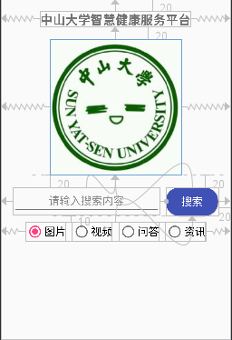
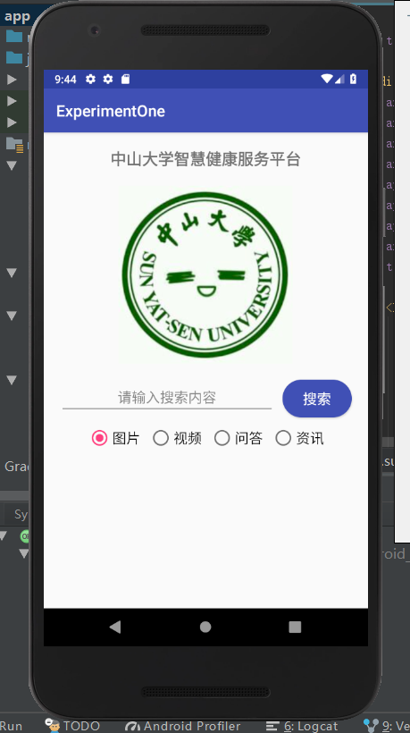
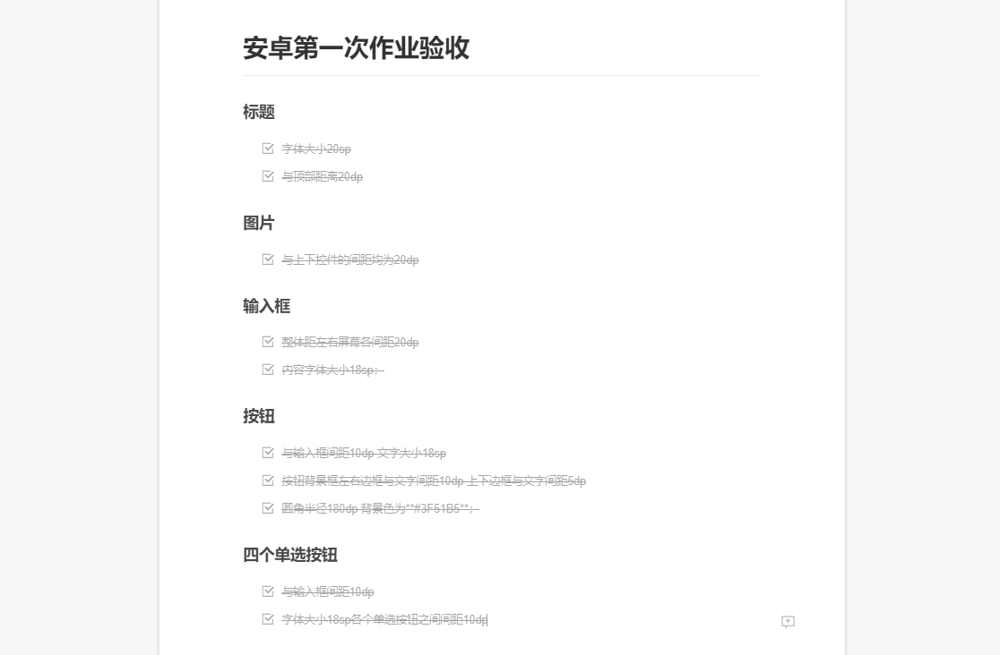
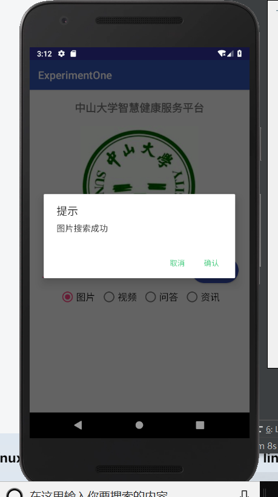
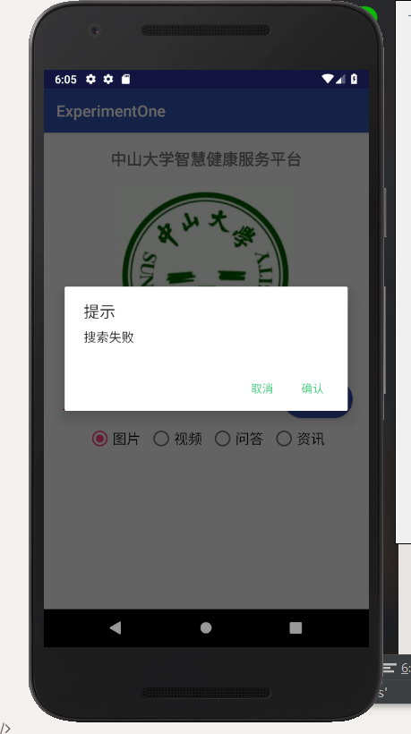

# 中山大学数据科学与计算机学院本科生实验报告
## （2018年秋季学期）
| 课程名称 | 手机平台应用开发 | 任课老师 | 郑贵锋 |
| :------------: | :-------------: | :------------: | :-------------: |
| 年级 | 16级 | 专业（方向） | 嵌入式软件 |
| 学号 | 16340192 | 姓名 | 宋晓彤 |
| 电话 | 15521506587 | Email | 1252418308@qq.com |
| 开始日期 | 2018.10.7 | 完成日期 | 2018.10.7 |

---

## 一、实验题目

​	基本的UI界面设计与事件处理

---


## 二、实现内容

1. 实现一个android应用，界面根据相关参数设置实现相应效果

2. 熟练掌握android_contraintLayout布局方式和控件使用方法

   主要要求内容：间距、字号、颜色、按钮圆角、单选按钮

3. 了解Android编程基础。

4. 熟悉Button、RadioButton、EditText等基本控件，能够处理这些控件的基本事件。

5. 学会弹出对话框，并定制对话框中的内容，能对确定和取消按钮的事件做处理。

---


## 三、课堂实验结果
### (1)实验截图



### (2)实验步骤以及关键代码

***【UI设计】***

**a. 制作文本控件——中山大学智慧健康服务中心**

​	在制作包含文本的控件的时候，要把字符存在values下string.xml文件中，再通过@string/message方法调用字符内容

```
<string name="headline1">中山大学智慧健康服务平台</string>

android:layout_marginTop="20dp"
android:gravity="center"
android:textSize="20sp"
app:layout_constraintLeft_toLeftOf="parent"
app:layout_constraintRight_toRightOf="parent"
```

**b. 制作图片控件——sysu**

​	制作图片控件时，先把图片复制到drawable文件夹下，再通过与字符相同的引用方式得到图片内容

```
android:layout_marginTop="20dp"
android:src="@drawable/sysu"
app:layout_constraintLeft_toLeftOf="parent"
app:layout_constraintRight_toRightOf="parent"
app:layout_constraintTop_toBottomOf="@id/headline1"
```

**c. 制作按钮控件——搜索**

​	搜索框圆角样式需要通过新建一个样式xml进行设置，实验中我在drawable下新建了button_shape.xml这个文件，然后设置button的background为drawable下的button_shape文件，从而完成样式的设计

```
<?xml version="1.0" encoding="utf-8" ?>
<shape xmlns:android="http://schemas.android.com/apk/res/android"
    android:shape="rectangle">
    <solid android:color="#3F51B5" />
    <corners android:radius="180dp" />
</shape>

android:background="@drawable/button_shape"
android:paddingTop="5dp"
android:paddingBottom="5dp"
android:paddingStart="10dp"
android:paddingEnd="10dp"
android:textSize="18sp"
android:layout_marginTop="20dp"
android:layout_marginEnd="20dp"
app:layout_constraintTop_toBottomOf="@id/sunyatsen"
```

**d. 制作文本框控件——请输入搜索内容**

​	将默认文本存入string.xml文件后进行editview控件的格式调整

```
android:layout_width="0dp"
android:layout_marginStart="20dp"
android:layout_marginEnd="10dp"
android:layout_marginTop="20dp"
android:gravity="center"
android:textSize="18sp"
app:layout_constraintRight_toLeftOf="@id/searchbutton"
app:layout_constraintTop_toBottomOf="@id/sunyatsen"
```

**e. 制作单选按钮组合——图片、视频、问答、资讯**

​	radiogroup：设置整体居中和与上方控件的间距

```
android:orientation="horizontal"
app:layout_constraintTop_toBottomOf="@id/searchbutton"
app:layout_constraintLeft_toLeftOf="parent"
app:layout_constraintRight_toRightOf="parent"
android:layout_marginTop="10dp"
```

​	radiobutton：第一个单选按钮的checked属性是true，其余设为false表示默认选中第一个单选按钮，同时设置每一个button的id，表示单选

```
android:textSize="18sp"
android:checked="true"
android:layout_marginEnd="10dp"
```

***【事件触发】***

**a. 设置“搜索”按钮点击事件**

​	在布局文件中设置搜索按钮点击时运行searching函数

```
android:onClick="searching"
```

​	在java文件中编写searching函数：确定对话框样式（标题、点击确认取消时的onClickListener函数产生相应的Toast）->通过文本框内容决定产生的对话框和Toast信息

```
alert.setTitle("提示").
	setPositiveButton("确认",
		new DialogInterface.OnClickListener()).
	setNegativeButton("取消",
                new DialogInterface.OnClickListener());

if (search_content.equals("")) {
            Toast.makeText(getApplicationContext(), "搜索内容不能为空", Toast.LENGTH_SHORT).show();
        } else if (search_content.equals("Health")) {
            alert.setMessage("问答搜索成功");
            alert.show();
        } else {
            alert.setMessage("搜索失败");
            alert.show();
        }
```

​	由此：通过if else设置当输入框分别为空、Health、其他信息时，产生相应的dialog或Toast，通过dialog的set参数，设置其点击确认和取消时产生的Toast信息。

**b. 设置单选选中Toast效果**

​	在布局文件中设置单选按钮点击时的click函数

```
android:onClick="clickpicture"
android:onClick="clickvideo"
android:onClick="clickqa"
android:onClick="clicknews"
```

​	在java文件的click函数中设置Toast产生

```
android:layout_marginTop="20dp"
android:src="@drawable/sysu"
app:layout_constraintLeft_toLeftOf="parent"
app:layout_constraintRight_toRightOf="parent"
app:layout_constraintTop_toBottomOf="@id/headlin
```

### (3)实验遇到的困难以及解决思路

**a. 文本框控件在约束时无法对齐搜索框，只能手动设置距离**

​	解决方案：将控件的layout_width设为0dp，这样可以根据约束的距离自动调整文本框的长度，不需要手动计算页面尺寸调节和搜索框的间距了。

**b. 虚拟机跑代码时总是出现“guest isn‘t online after 7 minutes”报错**

​	解决方案：将虚拟机的启动转换为冷启动cold boot就可以解决这样的问题，但是后来还是有类似情况的发生。最后检查发现是我每次关闭虚拟机的方式不对，应该长按电源键关闭，点击一下仅仅是锁屏，就会发生这样的情况：能跑出页面但是会提示上述报错。

**c. 虚拟机报错后还能跑，跑出来的内容是未经过修改的内容**

​	解决方案：先在系统中完成一次build，然后在用虚拟机跑，修改完代码直接用虚拟机跑就会蜜汁无法修改，但是build完在用虚拟机跑就可以了。

**d. 编译是R报错标红**

​	解决方案：clear project 重启

**e.  dialog的修改不过编译，不能连续.新的函数参数**

​	解决方案：如果感觉代码没有问题就是不过编译，报错显示需要有；或者），一般都是有些标点没有使用英文字符，所以一直报错，检查颜色高亮之后修改。

**f. Radiogroup组里面的按钮无法实现单选**

​	解决方案：radiogroup想要实现单选要给里面的每一个button都设定一个id，这样才能实现按钮组的单选效果。

**g. 完成的样式不像安卓常见的系统风格**

​	解决方案：把输入框固定成了输入单行；把对话框的两个按钮颜色修改成了绿色；点击搜索的时候把输入框收起来。

---

## 四、课后实验结果

***【UI设计】***

**模拟结果**



**检验内容**



***【事件触发】***

**a.Toast：搜索内容为空** 


**b. 对话框：搜索成功**



**c.对话框：搜索失败**



**d. Toast：确定**


**e.Toast：取消**


**f. Toast：单选按钮**


---


## 五、实验思考及感想

***【UI设计】***	

​	这是一次实现UI的实验，主要需要我们了解的就是约束布局的方式，感觉上约束布局应该指的是通过控件与控件之间的关联方式确定app界面的布局结构。在做搜索框和文本框的时候，我把他们都跟图片做了约束，但是看起来的效果有些奇怪，而且两个控件的高度是不同的，因为搜索按钮的高度是固定的，就导致preview的时候看两个控件的位置轮廓和约束时感觉有点怪异。在网上搜索了一下能不能把文本框和搜索按钮组合在一起成为一个元素，这样比较方便排版和做约束，但是搜索过后发现好像是要用别的布局，暂时就放弃了，后面可以再学习。

​	然后遇到的一个最大的问题就是不知道gitignore怎么写，就是作业要求不能提交没意义的文件，但是我不是很知道什么文件算是没有意义的，所以这个部分有点迷，但是还是硬着头皮push了。

​	在做这个作业的过程中有尝试修改一下其他的格式，比如修改了搜索文本框提示文字的颜色，觉得做排版还是很有趣的，而且如果能就此完成一些交互还是很有成就感的，虽然作业完成的过程离不开疯狂CSDN……不过在做这次作业重复编写命令的时候，没有选择复制或者自动补全，大部分都是自己打出来，因此也慢慢记住了各种参数代码的作用，感觉上手做页面是非常快的，除了每时每刻都在担心AS会不会突然出现一些莫名其妙的问题然后让我无所适从，暂时说来体验还是不错。

***【事件触发】***

​	基本的事件处理的几种方法的区别应该就是监听器设置的位置了，是在java文件中设置还是在xml布局文件中声明之后直接在java文件中实现。在本次实验中我选择的是在xml中声明然后在java文件中直接实现。我觉得这种方法在逻辑上是比较清晰的，如果在java中设置click的监听然后再处理可能没有很直观，但是如果在xml中声明，我只要找到空间的click属性对应的函数再直接查看就好。文件结构上的缺点可能就是函数比较冗余吧。

​	还有就是在单选按钮的处理上，我是对四个按钮每个按钮都设置了click属性然后实现了函数。但是可能有方法是可以用radiogroup的属性直接处理的，就不用四个按钮的函数都要实现了，只需要找到被点击的按钮的文字然后做出相应的Toast文字设置即可，但是没有弄明白这样应该怎么做，后续可以再进行研究。

---

