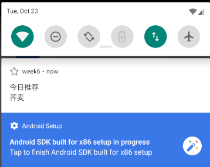
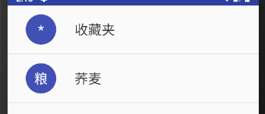

# 中山大学数据科学与计算机学院本科生实验报告
## （2018年秋季学期）
| 课程名称 | 手机平台应用开发 | 任课老师 | 郑贵锋 |
| :------------: | :-------------: | :------------: | :-------------: |
| 年级 | 16级 | 专业（方向） | 嵌入式软件与系统 |
| 学号 | 16340192 | 姓名 | 宋晓彤 |
| 电话 | 15521506587 | Email | 1252418308@qq.com |
| 开始日期 | 2018.10.20 | 完成日期 |2018.10.27|

---

## 一、实验题目

【week7】

**Broadcast使用**

a. 掌握 Broadcast 编程基础。

b. 掌握动态注册 Broadcast 和静态注册 Broadcast。

c. 掌握Notification 编程基础。

d. 掌握 EventBus 编程基础。

【week8】

 **AppWidget 使用**

a. 复习 Broadcast 编程基础。

b. 复习动态注册 Broadcast 和静态注册 Broadcast 。

c. 掌握 AppWidget 编程基础。

---

## 二、实现内容

【week7】

在第六周任务的基础上，实现静态广播、动态广播两种改变Notification 内容的方法。 

a. 在启动应用时，会有通知产生，随机推荐一个食品。 点击通知跳转到所推荐食品的详情界面。 点击收藏图标，会有对应通知产生，并通过Eventbus在收藏列表更新数据。 点击通知返回收藏列表。 

b. 实现方式要求:启动页面的通知由静态广播产生，点击收藏图标的通知由动态广播产生。

【week8】

在第七周任务的基础上，实现静态广播、动态广播两种改变widget内容的方法。 

点击widget可以启动应用，并在widget随机推荐一个食品。 

点击widget跳转到所推荐食品的详情界面。 

点击收藏图标，widget相应更新。 

点击widget跳转到收藏列表。 

实现方式要求:启动时的widget更新通过静态广播实现，点击收藏图标时的widget更新通过动态广播实现。

---

## 三、实验结果
### (1)实验截图

【week7】

A. 打开页面弹出推荐通知



B. 点击收藏夹弹出收藏通知


C. 点击收藏通知打开收藏夹



【week8】

D. 当前无新消息 widget


E. 今日推荐widget


F. 已收藏widget 


### (2)实验步骤以及关键代码

【week7】

A. 设计通知栏通知

?	a. 注册静态广播

```
<receiver
    android:name=".MyReceiver1">
    <intent-filter>
        <action android:name="start" />
    </intent-filter>
</receiver>
```

?	b. 编写broadcast的继承类，重写onReceive函数，表明当接收到当前的广播时，执行onReiceive函数

?	c. 根据接收的数据内容创建通知栏消息

```
NotificationCompat.Builder builder = new NotificationCompat.Builder(context, channel_id);
builder.setContentTitle("今日推荐")...;
```

?	d. 设置通知栏消息点击的效果，使用PendingIntent

```
PendingIntent mPendingIntent=PendingIntent.getActivity(context,0,mInent,PendingIntent.FLAG_UPDATE_CURRENT);
builder.setContentIntent(mPendingIntent);
```

B. 设计收藏夹通知

?	a. 在详情页中注册动态广播

```
IntentFilter intentFilter= new IntentFilter();
intentFilter.addAction("collect");
mReceiver=new DynamicReceiver();
registerReceiver(mReceiver,intentFilter);
```

?	b. 实现动态广播的类的内容，设置点击事件

```
Intent mInent = new Intent(context,MainActivity.class);
mInent.putExtras(bundle);
PendingIntent mPendingIntent = PendingIntent.getActivity(context, 0, mInent,PendingIntent.FLAG_UPDATE_CURRENT);
builder.setContentIntent(mPendingIntent);
Notification notify = builder.build();
manager.notify(1, notify);
```

?	c. 在收藏夹图标的点击时间中添加通知，代码同上

?	d. 设置点击通知栏事件，跳转到页面

```
Intent intent1=new Intent("collect");
```

C. mainActivity修改

?	a. 由于点击收藏夹时要更新收藏夹内容且要显示收藏夹，所以需要用你eventbus传递相关参数，调整当前显示

```
protected void onNewIntent(Intent intent) {
    super.onNewIntent(intent);
    setIntent(intent);
    Intent intent1 = getIntent();
    collectlist.setVisibility(View.VISIBLE);
    foodlist.setVisibility(View.GONE);
    changebutton.setImageResource(R.drawable.mainpage);
    flag = 1;
}
```

【week8】

A. 新建widget文件

 ```
   updateView.setOnClickPendingIntent(R.id.appwidget_text, pi); 
            ComponentName me = new ComponentName(context, NewAppWidget.class);
            appWidgetManager.updateAppWidget(me, updateView);
 ```

B. 重写onReceive函数

?	a. 判断如果是静态广播传递的值

```
updateView.setTextViewText(R.id.appwidget_text, "今日推荐 " + food.getName());
updateView.setOnClickPendingIntent(R.id.appwidget_text,myPendingIntent);
ComponentName cn = new ComponentName(context, NewAppWidget.class);
```

?	b. 判断如果是动态广播的值

```
updateView.setTextViewText(R.id.appwidget_text, "已收藏 " + food.getName());
updateView.setOnClickPendingIntent(R.id.appwidget_text,myPendingIntent);
ComponentName cn = new ComponentName(context, NewAppWidget.class);
```

C. 在MainActivity中做相应的修改

```
intentBroadcast.setComponent(new ComponentName("com.example.a12524.experimentone_week6", "com.example.a12524.experimentone_week6.NewAppWidget"));
sendBroadcast(intentBroadcast);
```

D. 在ListAction中做相应的修改

```
mReceiver=new DynamicReceiver();
mwidget= new NewAppWidget();
registerReceiver(mReceiver,intentFilter);
registerReceiver(mwidget,intentFilter);
```

### (3)实验遇到的困难以及解决思路

【week7】

A. 通知栏显示不出来

?	android8.0版本之后通知栏的显示不正常，是因为8.0新增了通知渠道NotificationChannel，定义了通知的类别，查看博客找到方法，需要在通知的定义处增加一个通道的定义才可以正常显示

```
int importance = NotificationManager.IMPORTANCE_HIGH;
channel = new NotificationChannel(channel_id, name, importance);
channel.setDescription(des);
channel.enableLights(true);
manager.createNotificationChannel(channel);
```

B. 在收藏夹图标上点击后产生全新的activity页面

?	产生这个错误的原因是没有设置单例模式，就是TA在说明文档中提到的LaunchMode，单例模式相当于只允许创建该类的唯一一个实例，这样类的实例的状态将会被保存，不会出现启动新实例的情况

```
android:launchMode="singleTask"
```

C. EventBus多个订阅者调用

?	Eventbus支持多个订阅者，EventBus3.0之后，事件处理的方法可以随便取名，但是需要添加一个注解@Subscribe，并且要指定线程模型。

D. 在单例模式下，系统不会再调用通常情况下我们处理请求数据的onCreate方法，而是调用onNewIntent方法 

```
protected void onNewIntent(Intent intent)
```

【week8】

E. 使用setComponent函数的时候只能传递给一个java文件

?	同时用静态广播向静态广播接收器和widget发送广播内容的时候，发现后面的set覆盖了前面的set，打开了setComponent的定义才发现是修改了this.intent的内容，但是删除了又无法正常广播，所以就发送了两次静态广播，一次发给notification，一次发给widget

---


## 四、实验思考及感想

【week7】

?	在安卓项目设计时，参数传递是一个很重要的过程，每个行为都可能存在数据的传递，目前我们已经学习了三种参数传递的方法。

?	首先，intent机制可以完成应用的交互通讯，以及同时完成参数的传递，可以使用intent直接传值，也可以用bundle将数据封装起来然后利用intent传递；第二个，EventBus是一个很简单的线程传递数据的方法，在3.0之后可以在四种线程范围内定义方法并给事件处理方法随便取名，简化了组件间数据传递的方法，四种线程模式分别是onEvent、onEventMainThread、onEventBackgroundThread和onEventAsync ；还有一种就是单例模式下的onNewIntent方法，在切换activity的时候会自动调用onNewIntent方法而不是onCreate方法，做到了数据的保留。

【week8】

?	第七周的实验做完还迷迷糊糊的，但是通过这次实验对广播有了比较具体的认识。广播的具体思路是通过广播信号和具体参数的传递，我们要达到相应的事件处理效果。

?	这个过程是我们可以对接收广播的类进行修改，保证在收到相应广播的时候更够做出相应的反应，而整体实现的思路就很简单：在安卓项目中完成广播的注册，让项目意识到已经存在这个名字的action广播；然后在所要进行广播的位置创建并发送这个广播以及记得注销；最后在相应的类中判断接收到的广播名是否是需要的，再利用intent传递的数据进行相应的操作，就可以完成广播的内容。

------