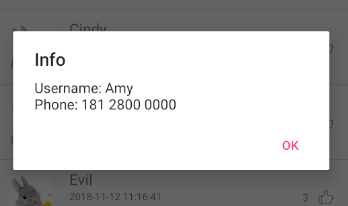

# 中山大学数据科学与计算机学院本科生实验报告
## （2018年秋季学期）
| 课程名称 | 手机平台应用开发 | 任课老师 | 郑贵锋 |
| :------------: | :-------------: | :------------: | :-------------: |
| 年级 | 16 | 专业（方向） | 嵌入式软件与系统 |
| 学号 | 16340192 | 姓名 | 宋晓彤 |
| 电话 | 15521506587 | Email | 1252418308@qq.com |
| 开始日期 | 2018.11.13 | 完成日期 |2018.11.15|

---

## 一、实验题目

数据存储（一）

1. 学习SharedPreference的基本使用。
2. 学习Android中常见的文件操作方法。
3. 复习Android界面编程。

数据存储(二)

1. 学习SQLite数据库的使用。
2. 学习ContentProvider的使用。
3. 复习Android界面编程。

---

## 二、实现内容

**【week10】**

- 应用首次启动，界面呈现出两个输入框，分别为新密码输入框和确认密码输入框。。

- 完成创建密码后，退出应用再进入应用，则只呈现一个密码输入框。

  Internal Storage和External Storage的区别及用法在思考处

**【week11】**

实现一个评论应用  

1. 使用SQLite数据库保存用户的相关信息和评论的相关信息，使得每次运行程序都可以使用数据库进行用户的登陆与注册，以及显示数据库中的评论；
2. 使用ContentProvider来获取对应用户的电话号码；

---

## 三、实验结果
### (1)实验截图

**【week10】**


**【week11】**

##### **【登录界面】**

用户名为空


密码为空


用户名不存在


密码错误


##### **【注册界面】**

密码不匹配


用户名已存在


【评论列表】

短按




长按


点赞


【评论功能】

评论为空


评论成功


【加分项】

头像添加


点赞见上

### (2)实验步骤以及关键代码

**【week10】**

1. 添加两个activity，并分别完成UI的设计

2. 在MainActivity的java文件中定义一个sharedperference，用来存储相应的设计，为了进行输入的增删查改，定义一个editor作为操作的工具

   ```
   preferences = getSharedPreferences("password", MODE_PRIVATE);
   editor = preferences.edit();
   ```

   这时我们发现只要在密码输入页进行简单的函数操作即可

3. 点击Clear的函数：将两个元件的显示文字置空

   ```
   newPassword.setText(null);
   confirmPassword.setText(null);
   ```

4. 点击OK的函数：其中，editor的操作要经过commit才可以有效将键值对输入进preference

```
          if(first){
            if(newpassword.equals("") || confirmpassword.equals("")){
                Toast.makeText(MainActivity.this, "Password cannot be empty.", Toast.LENGTH_SHORT).show();;
            }
            else if(newpassword.equals(confirmpassword)) {
                editor.putString("1", newpassword);
                editor.commit();
                Intent intent = new Intent(MainActivity.this, EditActivity.class);
                startActivityForResult(intent, 0);
            }
            else{
                Toast.makeText(MainActivity.this, "Password Mismatch.", Toast.LENGTH_SHORT).show();
            }
```

1. 这时我们发现，当输入正确的两个密码时，输入框要有改变，所以我们需要判断当前产生的密码页是什么状态的。为了保证每次重启应用可以留存主这个状态，我们同样使用sharedpreference保存这个状态

   - 在页面产生时就默认得到一个初始的first判断布尔值true

     ```
     first = preferences.getBoolean("first", true);
     if(!first){
         newPassword.setVisibility(View.GONE);
         confirmpassword = null;
         confirmPassword.setText(null);
         confirmPassword.setHint("Password");
     }
     ```

   - 在点击ok按钮的时候，如果匹配了，就将这个值改写为false表示当前的状态应为输入密码而非注册密码，同时把页面元件的显示、文字进行适当的调整

     ```
     newPassword.setVisibility(View.GONE);
     confirmpassword = null;
     confirmPassword.setText(null);
     confirmPassword.setHint("Password");
     ```

   - 针对密码确认的页面，我们需要给ok按钮的点击时间增加判断密码是否存在的函数，所以我们将上面的代码块设定为当first这个值是true时，为first为false设定新的内容  

     ```
     String ref = preferences.getString("1", "");
     Log.e("pass1", ref);
     Log.e("confir", confirmpassword);
     if(confirmpassword.equals("")){
         Toast.makeText(MainActivity.this, "Password cannot be empty.", Toast.LENGTH_SHORT).show();
     }
     else if(confirmpassword.equals(ref)){
         Intent intent = new Intent(MainActivity.this, EditActivity.class);
         startActivityForResult(intent, 0);
         finish();
     }
     else{
         Toast.makeText(MainActivity.this, "Invalid Password.", Toast.LENGTH_SHORT).show();
     }
     ```

   - 这时我们需要完成文件编辑的部分，这部分就很简单了，只要写好相应的点击事件即可

     保存

     ```
     public void click_save(View button){
         try (FileOutputStream fileOutputStream = openFileOutput(filename, MODE_PRIVATE)) {
             String str = file.getText().toString();
             fileOutputStream.write(str.getBytes());
             Toast.makeText(EditActivity.this, "Save successfully", Toast.LENGTH_SHORT).show();
         } catch (IOException ex) {
             Toast.makeText(EditActivity.this, "save failed", Toast.LENGTH_SHORT).show();
         }
     }
     ```

     加载

     ```
     public void click_load(View button){
         try (FileInputStream fileInputStream = openFileInput(filename)) {
             byte[] contents = new byte[fileInputStream.available()];
             fileInputStream.read(contents);
             file.setText(new String(contents, "UTF-8"));
             Toast.makeText(EditActivity.this, "Load successfully.", Toast.LENGTH_SHORT).show();
         } catch (IOException ex) {
             Toast.makeText(EditActivity.this, "Fail to load file.", Toast.LENGTH_SHORT).show();
         }
     }
     ```

     关闭回到桌面

     ```
     public boolean onKeyDown(int keyCode, KeyEvent event) {
     
         if (keyCode == KeyEvent.KEYCODE_BACK) {
             Intent home = new Intent(Intent.ACTION_MAIN);
             home.setFlags(Intent.FLAG_ACTIVITY_CLEAR_TOP);
             home.addCategory(Intent.CATEGORY_HOME);
             startActivity(home);
             return true;
         }
         return super.onKeyDown(keyCode, event);
     }
     ```


**【week11】**

**第一步**：创建xml文件，其中，我们需要登录/注册页、评论页以及listview评论记录布局

注意：

1. item即记录布局内，要将点赞的focusable属性设置为false，避免主动获得焦点导致覆盖
2. 将item布局的总属性中添加android:descendantFocusability="blocksDescendants"，以便列表和点赞的点击事件可以分别触发

**第二步**：编写listview的类和适配器，略

```
public class CommentInfo {
    private byte[] head;
    private String name;
    private String time;
    private String comment;
    private int number;
    private int imageID;
    private int status;
}
```

**第三步**：数据库操作，其中，我们建立了两个表，分别是用户信息表和评论信息表，为了完成后续操作，我们需要定义用户信息和评论信息的插入、评论信息的删除、用户信息的查询、评论信息的更新；同时，为了方便表的检索，我们又将当前登录进来的用户的信息传入数据库，以便进行操作

建表

```
public void onCreate(SQLiteDatabase db) {
    String CREATE_TABLE1 = "CREATE TABLE if not exists "
            + ACCOUNT_TABLE
            + " (name TEXT PRIMARY KEY, password TEXT, head BLOB)";
    db.execSQL(CREATE_TABLE1);
    String CREATE_TABLE2 = "CREATE TABLE if not exists "
            + COMMENT_TABLE
            + " (name TEXT, comment TEXT, time TEXT, number INTEGER, status INTEGER, goodlist TEXT, Constraint commentid PRIMARY KEY (name, comment, time))";
    db.execSQL(CREATE_TABLE2);
}
```

更新评论

```
public void upgradeComment(String username, String comment, String time, int number, int status, String user){
    SQLiteDatabase db = getWritableDatabase();
    Cursor cursor = db.rawQuery("SELECT goodlist FROM comment WHERE name = ? AND comment = ? AND time = ?", new String[]{username, comment, time});
    String oldlist = "";
    if(cursor.moveToFirst()){
        oldlist = cursor.getString(cursor.getColumnIndex("goodlist"));
    }
    Log.e("myDB", "old:"+oldlist + "status " + status);
    if(!havegood(oldlist, user) && status == 1){
        Log.e("myDB1", "add");
        if(!oldlist.equals(""))
            oldlist += ",";
        oldlist = oldlist + user;
    }
    else if(status == 0){
        Log.e("myDB1", "minus");
        oldlist = deleteSubString(oldlist, user);
    }
    ContentValues cv = new ContentValues();
    cv.put("number", number);
    cv.put("goodlist",oldlist);
    cv.put("status",status);
    Log.e("myDB", "new:"+oldlist);
    String whereClause11 = "name=? AND comment=? AND time=?";
    String[] str = {username, comment, time};
    db.update(COMMENT_TABLE, cv, whereClause11, str);
    Log.e("new status", String.valueOf(status));
    db.close();
}
```

插入用户信息及插入评论信息

```
public void insertAccount(String name, String password, byte[] img) {
    SQLiteDatabase db = getWritableDatabase();
    ContentValues cv = new ContentValues();
    cv.put("name", name);
    cv.put("password", password);
    cv.put("head", img);
    db.insert(ACCOUNT_TABLE, null, cv);
    db.close();
}
public void insertComment(String name, String comment, String time, int number, int status, String names) {
    SQLiteDatabase db = getWritableDatabase();
    ContentValues cv = new ContentValues();
    cv.put("name", name);
    cv.put("comment", comment);
    cv.put("time", time);
    cv.put("number", number);
    if(havegood(names, name))
        cv.put("status", 1);
    else
        cv.put("status", 0);
    cv.put("goodlist", names);
    db.insert(COMMENT_TABLE, null, cv);
    db.close();
}
   
```

查询用户信息

         public HashMap<String, Object> findAccount(String name) {
    
            SQLiteDatabase db = getWritableDatabase();
        HashMap<String, Object> map = new HashMap<String, Object>();
        try{
            Cursor cursor = db.rawQuery("SELECT name, password, head FROM account WHERE name = ?", new String[]{name});
            if(cursor.moveToFirst()){
                map.put("name", cursor.getString(cursor.getColumnIndex("name")));
                map.put("password", cursor.getString(cursor.getColumnIndex("password")));
                map.put("head", cursor.getBlob(cursor.getColumnIndex("head")));
            }
    
        }catch (NullPointerException e){
    
        }
        return map;
    }

删除评论

```
public void deleteComment(String name, String comment, String time){
    SQLiteDatabase db = getWritableDatabase();
    String whereClause = "name=? AND comment=? AND time=?";
    String[] whereArgs={name, comment, time};
    db.delete(COMMENT_TABLE, whereClause, whereArgs);
    db.close();
}
```

注意：

1. 在使用cursor时，应该使用先if movetoFirst，然后while movetonext的格式，前一个语句使cursor的指针指向第一个获得的数据记录，，然后依次向下寻找，这样做的理由是如果没有找到相关记录则不会进行相应的触发，避免报错
2. db的查询使用应该注意，whereargs，也就是具体的查询条件是独立出来的，往往是用一个string的元组存储的

**第四步**：编写mainActivity的java文件，具体内容按照上一周作业的内容布置

注意：

1. 在java文件中编写了两个函数，loginmode和registermode，功能为分别对两个模式进行页面内容和组件属性的初始化，通过单选按钮的checkedchange属性分别调用

   ```
   public void login_mode(){
       password.setText(null);
       conpassword.setText(null);
       conpassword.setVisibility(View.GONE);
       head.setVisibility(View.GONE);
       password.setHint(R.string.password_hint);
   }
   ```

2. 当点击ok按钮时，新增的判断条件有：该记录是否匹配数据库用户名内容，如果匹配到内容，密码是否正确

   ```
   if(pass == null){
       Log.e("login", "not exist");
       Toast.makeText(MainActivity.this, "Username not existed.", Toast.LENGTH_SHORT).show();
   }
   else if(!(pass.equals(password.getText().toString()))) {
       Toast.makeText(MainActivity.this, "Invalid Password.", Toast.LENGTH_SHORT).show();
   }
   ```

3. 接上，登录成功时，由于需要记录登录者的用户名，我们需要将当前登录的用户名传入新的activity，同时把登录界面还原

   ```
   else{
       Log.e("check", "success");
       Intent intent = new Intent(MainActivity.this, Comment.class);
       intent.putExtra("username", username.getText().toString());
       username.setText(null);
       password.setText(null);
       conpassword.setText(null);
       startActivityForResult(intent, 0);
   }
   ```

4. 头像的设置：将图像转换为字节流进行存储和赋值，代码中，设定了三个字节流的变量，一个是默认头像，一个是给预设的测试账户名的头像，一个是用户自定义的头像

   ```
   res = getResources();
   baos = new ByteArrayOutputStream();
   bmp = BitmapFactory.decodeResource(res, R.mipmap.me);
   bmp.compress(Bitmap.CompressFormat.PNG, 100, baos);
   ```

5. 需要注意的是，在操作初应该判断当前的状态是登录还是注册，不同的状态有不同的响应

**第五步**：完成登录/注册页的编写之后，进入到commenet.java文件的编写，其中，我们需要实现的是点击、长按、评论、点赞功能

长按

```
AlertDialog.Builder dialog = new AlertDialog.Builder(Comment.this)
        .setMessage(choose)
        .setPositiveButton("YES", new DialogInterface.OnClickListener() {
            @Override
            public void onClick(DialogInterface dialog, int which) {
                if(choose1.equals("Delete or not?")){
                    database.deleteComment(comments.get(position).getName(), comments.get(position).getComment(), comments.get(position).getTime());
                    comments.remove(position);
                    adapter.notifyDataSetChanged();
                }
            }
        })
        .setNegativeButton("NO", new DialogInterface.OnClickListener() {
            @Override
            public void onClick(DialogInterface dialog, int which) {}
        });
dialog.show();
return true;
```

长按

```
if(cursor.moveToFirst()){
    tel += cursor.getString(cursor.getColumnIndex(ContactsContract.CommonDataKinds.Phone.NUMBER));
}
else{
    tel += "number not exist";
}
AlertDialog.Builder dialog = new AlertDialog.Builder(Comment.this)
        .setTitle("Info")
        .setMessage("Username: " + comments.get(position).getName() + tel)
        .setPositiveButton("OK", new DialogInterface.OnClickListener() {
            @Override
            public void onClick(DialogInterface dialog, int which) {}
        });
dialog.show();
```

评论

```
SimpleDateFormat formatter =  new SimpleDateFormat("yyyy年MM月dd日 HH:mm:ss");
                    Date curDate =  new Date(System.currentTimeMillis());
                    String systime  = formatter.format(curDate);
                    database.insertComment(username, addcomment.getText().toString(), systime, 0, 0, "");

                    HashMap<String, Object> user = database.findAccount(username);
                    byte[] temp_head =(byte[]) user.get("head");
                    CommentInfo comment = new CommentInfo(temp_head, username, systime, addcomment.getText().toString(), 0, R.mipmap.white, 0);
                    comments.add(comment);
                    addcomment.setText("");
                    adapter.notifyDataSetChanged();
```

点赞

```
if(!database.getStatus(comments.get(i).getName(), comments.get(i).getComment(), comments.get(i).getTime(), username)){
        Log.e("check if good", "not in");
        comments.get(i).setNumber(comments.get(i).getNumber()+1);
        comments.get(i).setImageID(R.mipmap.red);
        comments.get(i).setStatus(1);
        database.upgradeComment(comments.get(i).getName(), comments.get(i).getComment(), comments.get(i).getTime(), comments.get(i).getNumber(), 1, username);
    }
    else{
        Log.e("check if good", "in");
        comments.get(i).setNumber(comments.get(i).getNumber()-1);
        comments.get(i).setImageID(R.mipmap.white);
        comments.get(i).setStatus(0);
        database.upgradeComment(comments.get(i).getName(), comments.get(i).getComment(), comments.get(i).getTime(), comments.get(i).getNumber(), 0, username);
    }
    adapter.notifyDataSetChanged();
}
```

注意：

1. 在点赞的时候，我们需要查找当前的评论信息，看当前登录的用户是否在点赞列表里，判断后进行相应的操作，分别进行数据库的更新和listviw的同步

2. 评论时使用方法获取当前时间

3. 在长按的时候返回值一定要是true，否则会向下分发，触发点击事件；同时，也要判断是否是当前的账户的评论

4. 点击获取通讯录的时候也要进行权限的动态申请，同上面的图库权限一起，流程如下：

   （1） 当需要获取权限的时候就要进行当前权限的判断，如果没有申请就要发出申请，如果已经通过申请则开始操作

   （2） 如果用户通过了权限的申请，则进行相关操作

   注意：使用requestcode判断需要处理的申请

   ```
   public void onRequestPermissionsResult(int requestCode, @NonNull String[] permissions, @NonNull int[] grantResults) {
       if (requestCode == 2){
           if (grantResults[0] == PackageManager.PERMISSION_GRANTED){
           }
   }
   ```

### (3)实验遇到的困难以及解决思路

**【week10】**

​	在实验过程中，遇到一个很棘手的问题就是每次android studioo在重新编译运行app的时候，前一个app的运行状态会被保存，也就是说每次重新运行这个编译运行的过程，上一次的first的状态和密码都会保存下来

​	于是想了两种方法，一是每次重新编译运行的时候都卸载软件重新安装一次，但是这样比较麻烦，所以就想到了第二种，在onCreate中先把数据清空，再在onNewIntent中判断如果是false，证明这是经过onCreate修改得到的内容，这时改变页面的布局。但是如果要求结束进程后再次点开仍旧可以跳过注册，那么也是行不通的。

**【week11】**

1. 在进行数据库操作的时候，发现一直显示对象为空，后来发现，是因为没有在初始化的时候给database一个初始化的定义，所以一直为空。后面发现，其实很多为空的报错都是类似没有初始化定义的锅
2. 在运行app的时候，由于插入数据重复，所以每次都会新增数据，所以联想到添加组合主键，经过后面点赞的尝试之后，可以发现，想要每条数据保证不重复且可用，最好的主键组合是用户名、发布时间、和评论内容的组合。但是去掉评论内容也是可以的，因为一个用户基本上不能够在同一时刻发出两条评论，但是因为也不是很麻烦，就添加了内容这个部分。还有一个问题就是每次运行会报错，开始以为是写崩了，后来发现是因为主键冲突所以插入失败，但是不是程序的报错，而是需要达成的不要重复插入评论的功能。
3. 最大的问题应该是点赞功能在做的时候bug很多，往往要输出很多信息才能看到具体的错误原因，后面使用输出debug法完成了功能，但是付出了太多的时间，后面总结发现是当前comment的用户名和当前登录的用户名总是会产生混淆，以至于运行结果出现问题，这就说明下次一定要好好设计变量名。
4. 在判断用户是否在点赞列表里面的时候，使用split的方法分割成字符串数组，然后检查，但是由于""和null之间的区别，出现的bug很多，我就突然想到可以改成contains()，后面发现并没有bug了。但是又突然考虑到，如果一个用户名是另一个用户名的子集那contains就不好用了，于是还是果断改了回来，事实证明，当函数总是出现bug的时候，重写函数比debug要高效很多。

### （4）week11加分项解释

1. **评论与用户之间的关联**：没有新创建一个表，而是在评论信息的表中新增了一个点赞列表的部分，我们只需检查当前注册的账户是否在该条评论的点赞列表中，便可以判断这条评论的点赞状态，从而根据实际情况渲染添加不同的图片
2. **存储图片的方法**：添加的部分主要在mainActivity的java中完成，我们需要将图片转换为字节流，同时，在用户信息的表中，我们新增了属性为BLOB的head字段，通过BLOB与bitmap以及drawable、byte[]等形式的变量之间的转换，完成存储及提取，以下为将BLOB数据提取并赋值给ImageButton的过程

```
if(info.getHead() != null){
    Bitmap temp = BitmapFactory.decodeByteArray(info.getHead(), 0, info.getHead().length);
    Drawable drawable =  new BitmapDrawable(temp);
    head.setBackground(drawable);
}
```

3. **点赞状态及数字的获取**：如上，通过判断当前用户是否在该条评论的点赞表里面，从而判断操作的状态；以及评论包含number的属性字段，可以记录其点赞数

4. **点击事件的编写**：

   （1） 首先设定button不要自动获取焦点（参照博客直接写的时候点击事件还是被覆盖，所以在布局增加了descendantFocusability="blocksDescendants"）；

   （2） 然后将点击事件的接口设置好（有点投机地使用了delete的接口，然后在外部写方法的时候使用了点赞的相关代码，详细代码见上）；

   ```
       public interface onItemDeleteListener {
           void onDeleteClick(int i);
       }
   
       private onItemDeleteListener mOnItemDeleteListener;
   
       public void setOnItemDeleteClickListener(onItemDeleteListener mOnItemDeleteListener) {
           this.mOnItemDeleteListener = mOnItemDeleteListener;
       }
   
   ```

   （3） 正常编写list的点击事件，完成触发。

---

## 四、实验思考及感想

**【week10】**

​	经过本次实验，对数据存储的方式进行了思考，结合我遇到的问题，我认为我现在遇到的问题就是现在市面上很多的应用软件的更新模式，我们在更新软件的时候是安装了新的版本信息，这时候用户的数据还是保存在手机里的，但是当我们卸载重新安装之后，用户的以前登录信息是不会保存在手机中的。

​	而internal storage 顾名思义，就是应用程序内部的数据存储，应用程序之外的文件管理器等程序是看不见的，会随着卸载删除，而External storage就是外设的存储空间，如SD卡（但其实没有设置SD卡，数据也会有internal和external的区分），这部分数据是用户可见的。

​	所以说，internal storage相对来说更适合公开性低的内容，用户并没有必要提取的这部分内容，而external适合较为大的公开性高的内容，如音视频等等，方便用户对这部分数据进行操作。

**【week11】**

​	经过本次实验，我对安卓软件的数据存储以及软件的权限申请方面都有了更新的认识。通过数据库函数的撰写，练习掌握了基本数据库操作，如使用constraint primary key建立组合主键、使用？占位符进行条件判断的声明、用cursor存储结果并遍历等等。最重要的是，由于这次实验工程量有点大，完成的过程中顺便学了很多java的语法（当初java学得不是很好），这也是个意外收获。

​	以及通过重复不断的报错掌握了大部分bug的成因，不过有一个不足是一直都是使用输出debug法进行修改的，从这次点赞功能的复杂我就吸取到了教训，当结构比较复杂，虚拟机又很慢的时候，实在应该抓紧学会正常的调试方法。

​	更多的，我认为，在开发android软件的过程中实在不应该不做规划直接开始打，最起码的应该最好数据库设计再开动。完成这次实验的时候，由于没有充分体会实验题目，在建立数据库的时候，一开始做得很简单，做着做着发现不行，应该增加字段，比如用户名的head和评论的status和goodlist，都是写了一半增加的，增加就会导致很多内容产生变化，这在调整的时候是一个很浪费时间的事，所以不要着急，做好规划再开始动手。

​	而说到数据库设计，最重要的应该就是减少表的冗余，比如在comment表中查询头像的时候，应该采用先找name然后在账户的表中查找头像的方法，比起查询的麻烦，应该学会减少数据库冗余的设计。

---

